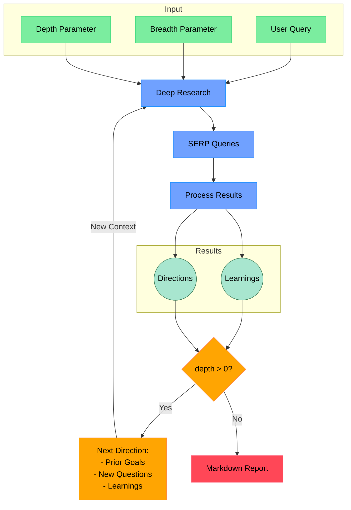

# Open Deep Research

An AI-powered research assistant that performs iterative, deep research on any topic by combining search engines, web scraping, and large language models.

The goal of this repo is to provide the simplest implementation of a deep research agent - e.g. an agent that can refine its research direction over time and deep dive into a topic. Goal is to keep the repo size at <500 LoC so it is easy to understand and build on top of.

If you like this project, please consider starring it and giving me a follow on [X/Twitter](https://x.com/dzhng). This project is sponsored by [Aomni](https://aomni.com).

## How It Works



## Features

- **Iterative Research**: Performs deep research by iteratively generating search queries, processing results, and diving deeper based on findings
- **Intelligent Query Generation**: Uses LLMs to generate targeted search queries based on research goals and previous findings
- **Depth & Breadth Control**: Configurable parameters to control how wide (breadth) and deep (depth) the research goes
- **Smart Follow-up**: Generates follow-up questions to better understand research needs
- **Comprehensive Reports**: Produces detailed markdown reports with findings and sources
- **Concurrent Processing**: Handles multiple searches and result processing in parallel for efficiency

## Requirements

- Node.js environment
- API keys for:
  - Firecrawl API (for web search and content extraction)
  - OpenAI API (for o3 mini model)

## Setup

### Node.js

1. Clone the repository
2. Install dependencies:

```bash
npm install
```

3. Set up environment variables in a `.env.local` file:

```bash
FIRECRAWL_KEY="your_firecrawl_key"
# If you want to use your self-hosted Firecrawl, add the following below:
# FIRECRAWL_BASE_URL="http://localhost:3002"

OPENAI_KEY="your_openai_key"
```

To use local LLM, comment out `OPENAI_KEY` and instead uncomment `OPENAI_ENDPOINT` and `OPENAI_MODEL`:

- Set `OPENAI_ENDPOINT` to the address of your local server (eg."http://localhost:1234/v1")
- Set `OPENAI_MODEL` to the name of the model loaded in your local server.

### Docker

1. Clone the repository
2. Rename `.env.example` to `.env.local` and set your API keys

3. Run `npm install`

4. Run the Docker image:

```bash
docker compose up -d
```

5. Execute `npm run docker` in the docker service:

```bash
docker exec -it deep-research npm run docker
```

## Usage

Run the research assistant:

```bash
npm start
```

You'll be prompted to:

1. Enter your research query
2. Specify research breadth (recommended: 3-10, default: 4)
3. Specify research depth (recommended: 1-5, default: 2)
4. Answer follow-up questions to refine the research direction

The system will then:

1. Generate and execute search queries
2. Process and analyze search results
3. Recursively explore deeper based on findings
4. Generate a comprehensive markdown report

The final report will be saved as `report.md` or `answer.md` in your working directory, depending on which modes you selected.

### Concurrency

If you have a paid version of Firecrawl or a local version, feel free to increase the `ConcurrencyLimit` by setting the `CONCURRENCY_LIMIT` environment variable so it runs faster.

If you have a free version, you may sometimes run into rate limit errors, you can reduce the limit to 1 (but it will run a lot slower).

### DeepSeek R1

Deep research performs great on R1! We use [Fireworks](http://fireworks.ai) as the main provider for the R1 model. To use R1, simply set a Fireworks API key:

```bash
FIREWORKS_KEY="api_key"
```

The system will automatically switch over to use R1 instead of `o3-mini` when the key is detected.

### Custom endpoints and models

There are 2 other optional env vars that lets you tweak the endpoint (for other OpenAI compatible APIs like OpenRouter or Gemini) as well as the model string.

```bash
OPENAI_ENDPOINT="custom_endpoint"
CUSTOM_MODEL="custom_model"
```

### Using AWS Bedrock (Claude 3.7 Sonnet)

This project supports using AWS Bedrock with the Anthropic Claude 3.7 Sonnet model (`anthropic.claude-3-7-sonnet-20250219-v1:0`) via the `@ai-sdk/amazon-bedrock` v2.x+ adapter.

To enable Bedrock:

1.  **Set Environment Variables:** You must explicitly set the following environment variables in your `.env.local` file. **Do not commit your actual credentials.**
    *   `AWS_REGION`: The AWS region for Bedrock (e.g., `us-east-1`).
    *   `AWS_ACCESS_KEY_ID`: Your AWS access key ID.
    *   `AWS_SECRET_ACCESS_KEY`: Your AWS secret access key.
    *   `AWS_SESSION_TOKEN`: (Optional) Your session token if using temporary credentials.
    *   `BEDROCK_THINKING_BUDGET`: (Optional) Set the token budget for Claude 3.7 Sonnet's extended thinking feature (min 1024, default 4000).

Example `.env.local` for Bedrock:

```dotenv
# .env.local (Example for AWS Bedrock - DO NOT COMMIT ACTUAL KEYS)
AWS_REGION="us-east-1"
AWS_ACCESS_KEY_ID="YOUR_AWS_ACCESS_KEY_ID"
AWS_SECRET_ACCESS_KEY="YOUR_AWS_SECRET_ACCESS_KEY"
# AWS_SESSION_TOKEN="YOUR_AWS_SESSION_TOKEN" # Only if using temporary credentials

# Optional: Configure thinking budget for Claude 3.7 Sonnet (min 1024, default 4000)
BEDROCK_THINKING_BUDGET="4000"

# You might also need Firecrawl key
FIRECRAWL_KEY="your_firecrawl_key"
```

The system will automatically prioritize Bedrock if `AWS_REGION` is set (and the credential variables are provided). The `@ai-sdk/amazon-bedrock` v2.x+ adapter requires these explicit environment variables and does not automatically use shared credential files (`~/.aws/credentials`) or IAM roles in the same way the standard AWS SDK might.

## How It Works

1. **Initial Setup**

   - Takes user query and research parameters (breadth & depth)
   - Generates follow-up questions to understand research needs better

2. **Deep Research Process**

   - Generates multiple SERP queries based on research goals
   - Processes search results to extract key learnings
   - Generates follow-up research directions

3. **Recursive Exploration**

   - If depth > 0, takes new research directions and continues exploration
   - Each iteration builds on previous learnings
   - Maintains context of research goals and findings

4. **Report Generation**
   - Compiles all findings into a comprehensive markdown report
   - Includes all sources and references
   - Organizes information in a clear, readable format

## License

MIT License - feel free to use and modify as needed.
